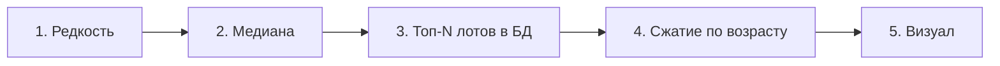

# Роадмап StalcraftBot

---

## Содержание

| № | Фаза |
|---|------|
| 1 | Редкость (`additional`) и артефакты |
| 2 | Медиана и статистика |
| 3 | Активные лоты → в БД только дешёвые |
| 4 | Сжатие истории по возрасту |
| 5 | Визуал и графики |

---

## Обзор порядка работ

Пункты **2** и **3** при блокерах можно слегка переставить; **фаза 5** всегда в конце.

---

## 1. Система редкости (additional), минимум для артефактов

| | |
|---|--|
| **Суть** | С API приходят **все** редкости одного предмета. На своей стороне: сортировка/фильтр или «тянем всё из API, в БД пишем только нужное» (например `additional` или выбранные тиры). |
| **Риск** | Агрегаты (медиана, история) не должны смешивать редкости без явного правила. |

### Код и схема

| Путь | Роль |
|------|------|
| `src/models/Lot.h` | Модель лота; сюда поле редкости |
| `src/core/ApiClient.cpp` | Парсинг JSON лотов |
| `src/core/Database.cpp`, `sql/schema.sql` | Таблица `lot_snapshots`, индексы, миграции |
| `src/core/Database.h` | Публичный API БД |
| `src/models/Item.h`, `src/core/ItemCatalogLoader.cpp` | Категория предмета (в т.ч. артефакты) |
| `src/core/Config.h`, `src/core/Config.cpp` | Опционально: список допустимых редкостей в настройках |

### Чеклист

- [ ] Зафиксировать модель данных: редкость у лота/связь с каталогом.
- [ ] Выбрать политику: фильтр при сохранении vs до БД — зафиксировать в коде/конфиге.
- [ ] Реализовать для артефактов; при необходимости расширить категории.
- [ ] Проверить раздельность агрегатов по редкости.

---

## 2. Пересмотр логики медианы и прочей статистики

| | |
|---|--|
| **Суть** | Пересмотреть окно выборки, фильтр выбросов, согласование с редкостью (отдельные медианы vs одна общая). |

### Код и схема

| Путь | Роль |
|------|------|
| `src/core/Scheduler.cpp` | `aggregateAndAnalyze`: медиана, выбросы, `upsertHourlyStat` |
| `src/ui/ItemManagerWidget.cpp` | Дублирующая медиана при ручном пересчёте |
| `src/core/Config.cpp`, `src/ui/SettingsWidget.cpp` | `auction/outlierFilterN`, `lotsLimit` |
| `src/models/PriceSnapshot.h` | Снимок статистики |
| `src/core/PriceAnalyzer.cpp` | Анализ относительно истории |
| `src/core/DealDetector.cpp` | Сравнение лотов с медианой |
| `src/ui/ActiveLotsWidget.cpp` | Медиана для колонки отклонения |

### Чеклист

- [ ] Задокументировать текущую формулу (окно, выбросы, минимум точек).
- [ ] Согласовать с политикой по редкости.
- [ ] При необходимости: робастные метрики (бакеты по времени, усечённое среднее и т.д.).
- [ ] Регрессия: «до / после» на одних данных.

---

## 3. Заполнение БД из активных лотов: только дешёвые

| | |
|---|--|
| **Цель** | В БД попадают не все лоты ответа, а **первые N** (например **10**) **самых дешёвых** после сортировки — меньше шума и нагрузки. |

### Код и схема

| Путь | Роль |
|------|------|
| `src/core/Scheduler.cpp` | `onLotsFetched` → `insertLotSnapshots` |
| `src/core/Database.cpp` | `insertLotSnapshots` |
| `src/core/ApiClient.h`, `src/core/ApiClient.cpp` | `fetchLots`, лимит, `m_config->lotsLimit()` |
| `src/core/Config.cpp` | Настройки лимита |
| `src/ui/ActiveLotsWidget.cpp` | UI активных лотов (согласовать отображение с политикой) |

### Чеклист

- [ ] Точка, где активные лоты превращаются в строки БД.
- [ ] Сортировка по цене ↑, срез до N (значение из конфига).
- [ ] Повторные синки: дедуп и инварианты.
- [ ] Проверка на реальном ответе API.

---

## 4. Временная агрегация / «сжатие» истории по возрасту лота

| | |
|---|--|
| **Идея** | Баланс: компактность БД и **качество данных** — недавняя история детальнее, старая грубее. |

### Правила гранулярности (черновик)

| Возраст лота | Гранулярность |
|--------------|----------------|
| **0–3** дня | Каждый лот |
| **3–7** дней | Агрегат за час |
| **7–20** дней | Порядка **2–3** цен в сутки |
| **20+** дней | Одна точка на сутки |

### Код и схема

| Путь | Роль |
|------|------|
| `src/core/Database.cpp` | `lot_snapshots`, `price_snapshots`, `hourly_stats`; `migrate()` |
| `sql/schema.sql` | Схема и миграции |
| `src/core/Database.h` | API |
| `src/core/Scheduler.cpp` | Возможные фоновые джобы пересборки |
| `src/core/ApiClient.cpp` | `fetchPriceHistory`, `handlePriceHistoryReply` |
| `src/ui/ItemManagerWidget.cpp` | Пагинация и сохранение истории по `priceHistoryFetched` |

### Чеклист

- [ ] Точные правила бакетов (min / max / last / median в бакете).
- [ ] Совместимость со старыми строками в БД.
- [ ] Пересборка истории при смене правил.
- [ ] Метрики: размер БД, скорость запросов, полезность графиков.

---

## 5. Визуал и графики (в самом конце)

| | |
|---|--|
| **Когда** | После стабилизации данных, редкости, медианы и сжатия. |

### Код и схема

| Путь | Роль |
|------|------|
| `src/ui/PriceChartWidget.h`, `PriceChartWidget.cpp` | График, линия медианы, ось времени |
| `src/ui/PriceTableWidget.cpp` | Таблица снимков |
| `src/ui/ActiveLotsWidget.cpp` | Активные лоты |
| `src/ui/MainWindow.h`, `MainWindow.cpp` | Вкладки и сборка UI |

### Чеклист

- [ ] Графики с учётом гранулярности и редкости.
- [ ] Легенды, фильтры по редкости, подписи осей.
- [ ] Полировка UI.

---

## Сводная таблица фаз

| Приоритет | Фаза | Ключевой результат |
|-----------|------|-------------------|
| 1 | Редкость | Корректное разделение данных по тирам |
| 2 | Медиана | Предсказуемая и документированная статистика |
| 3 | Топ-N в БД | Меньше шума в `lot_snapshots` |
| 4 | Сжатие по возрасту | Оптимальный объём и аналитика |
| 5 | Визуал | Отображение всего вышеперечисленного |

---
